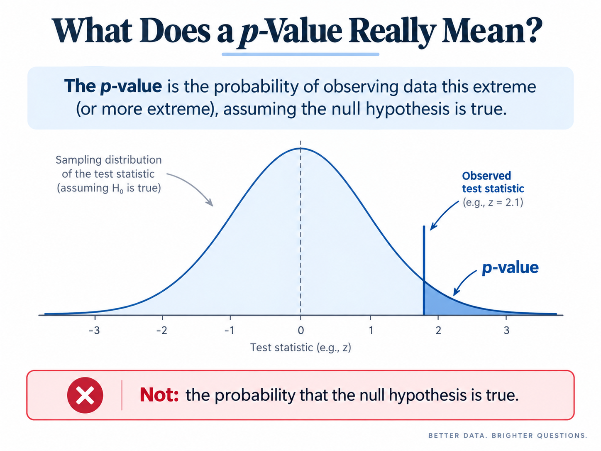

{width="1000px"}

One of the most common misunderstandings in statistics is the meaning of a p-value. Suppose a researcher runs a hypothesis test and obtains a p-value of 0.03. It is tempting to say that there is only a 3% chance that the null hypothesis is true. However, this interpretation is incorrect.

A p-value answers a different question.

Suppose the null hypothesis is denoted by \(H_0\). The p-value is the probability of observing a result at least as extreme as the one in our data, **assuming that the null hypothesis is true**. In simplified notation,

\[
p\text{-value}
=
P(\text{data as extreme or more extreme} \mid H_0).
\]

The important part is the condition "\(H_0\) is true." The p-value does not directly tell us

\[
P(H_0 \mid \text{data}),
\]

which would be the probability that the null hypothesis is true after observing the data. These two probabilities may look similar, but they answer very different questions.

## A Coin Example

Imagine that we want to determine whether a coin is fair. Our null hypothesis is

\[
H_0: p = 0.5,
\]

where \(p\) is the probability of getting heads.

Now suppose we flip the coin 20 times and observe 18 heads. If the coin is actually fair, the probability of getting 18 or more heads is only about 0.02%.

That makes 18 heads look very unusual under the assumption that the coin is fair.

The p-value captures exactly this idea. It asks:

> If the coin really were fair, how likely would it be to observe a result this extreme or even more extreme?

If we are doing a two-sided test, we would also count outcomes that are equally extreme in the opposite direction, such as getting 2 or fewer heads.

A very small p-value therefore suggests that the observed data are difficult to reconcile with the null hypothesis.

However, even a very small p-value does not prove that the null hypothesis is false. It only tells us that the data would be unusual if the null hypothesis were true.

## What a p-Value Does Not Mean

A p-value is often misinterpreted. In particular, it does **not** mean:

- the probability that the null hypothesis is true;
- the probability that the result happened "by chance";
- the size or importance of an effect;
- the probability that the study will replicate.

For example, a statistically significant result can still have a very small economic effect. With a sufficiently large sample, even a tiny difference can produce a small p-value.

## What Does 0.05 Mean?

A common convention is to call a result "statistically significant" when the p-value is below 0.05. This cutoff is useful as a rule of thumb, but it is not a magical boundary between truth and falsehood.

A p-value of 0.049 and a p-value of 0.051 represent almost the same amount of evidence, even though one may be labeled statistically significant and the other may not.

This is why researchers should not focus only on whether a p-value crosses the 0.05 threshold. Effect sizes, confidence intervals, sample size, and the economic meaning of the result also matter.

## Why the Concept Feels Unintuitive

The p-value is easy to misunderstand because people naturally want to ask:

> "Given the data, how likely is my hypothesis to be true?"

But the p-value asks the reverse question:

> "Assuming my hypothesis is true, how unusual are these data?"

That reversal in conditioning is the main reason the concept is unintuitive.

## The Main Takeaway

The easiest way to remember the meaning of a p-value is:

> A p-value measures how surprising the data are under the null hypothesis.

It does **not** measure the probability that the null hypothesis itself is true.

A p-value is therefore one piece of evidence about how well the data fit a hypothesis, not a direct probability that the hypothesis is right or wrong.

---
