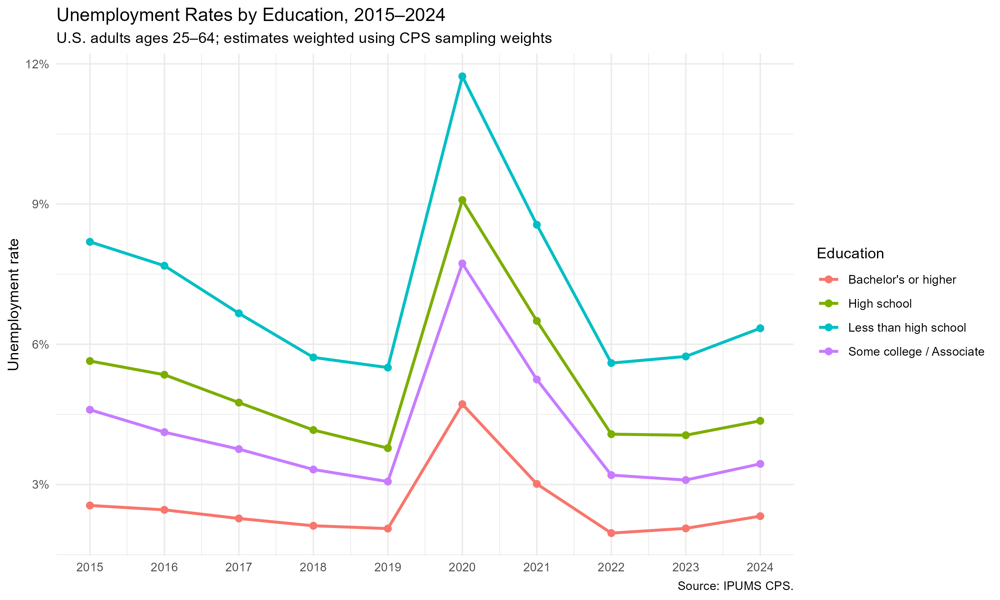
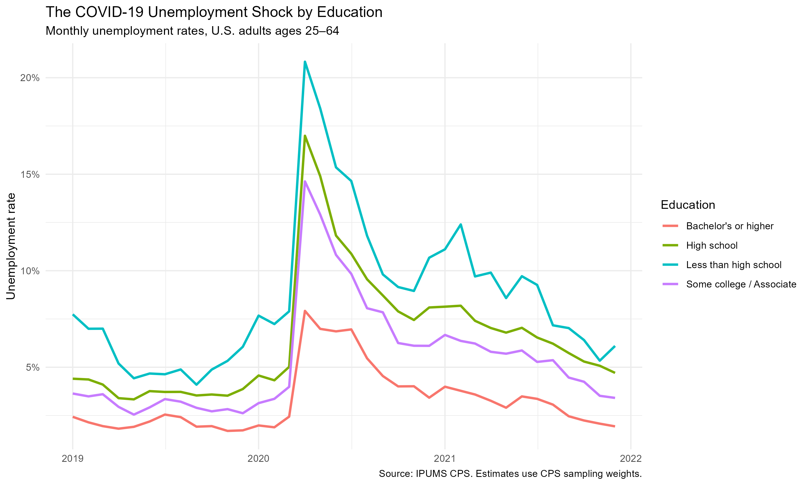
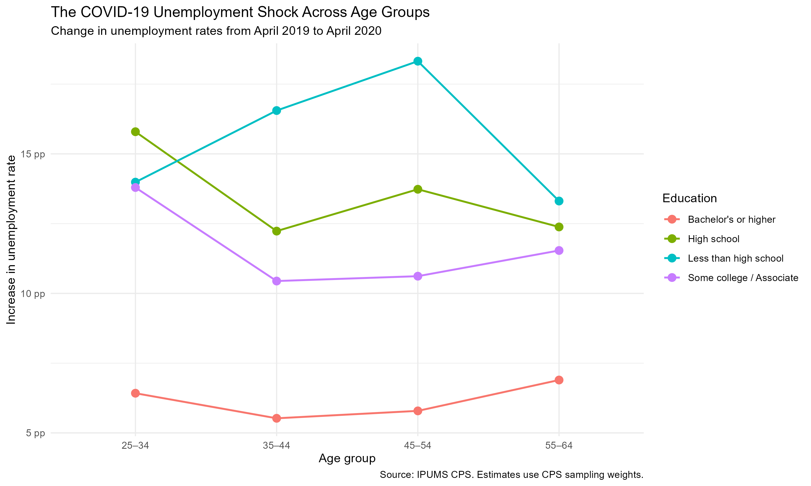

## Introduction

COVID-19 caused a sudden disruption in the U.S. labor market, but the effect was not evenly distributed across workers. One difference that stands out is education.

In this post, I use IPUMS Current Population Survey (CPS) data to look at how unemployment changed across education groups before, during, and after the COVID-19 shock. I also compare age groups to see whether the education gap was concentrated among younger workers or appeared more broadly.

I focus on adults ages 25 to 64 and divide education into four groups: less than high school, high school, some college or an associate's degree, and a bachelor's degree or higher.

## Data

The data come from the monthly IPUMS CPS from 2015 through 2024. I use age, education, employment status, year, month, and the CPS final person weight (`WTFINL`).

I restrict the sample to ages 25–64 because most people in this age range have already completed their education but are still of working age.

All unemployment rates are weighted using the CPS sampling weights. I calculate the unemployment rate as the weighted number of unemployed workers divided by the weighted labor force:

$$
\text{Unemployment Rate}
=
\frac{\text{Weighted Unemployed}}
{\text{Weighted Employed} + \text{Weighted Unemployed}}
$$

People who are not in the labor force are not included in this calculation.

## Unemployment Before and After COVID

The first figure shows annual unemployment rates by education from 2015 to 2024.

Before COVID-19, unemployment was falling for all four education groups. However, there was already a clear gap by education. Workers with less than a high school education consistently had the highest unemployment rate, while workers with a bachelor's degree or higher had the lowest.

That pattern became much more noticeable in 2020. Unemployment increased sharply for every group, but the increase was much larger among workers with less education.

After 2020, unemployment fell quickly again. By 2022 and 2023, the rates were much closer to their pre-pandemic levels, although the ordering across education groups remained similar.

## What Happened in 2020?

Annual averages hide how sudden the change was, so the second figure looks at monthly unemployment rates from 2019 through 2021.

The shock appears very clearly in the spring of 2020.

In April 2020, the unemployment rate was about 20.8% for workers with less than a high school education and 17.0% for high school graduates. The rate was around 14.6% for workers with some college or an associate's degree.

For workers with a bachelor's degree or higher, it was much lower at about 7.9%.

This is probably the clearest result in the data. The pandemic increased unemployment across the entire labor market, but workers with lower levels of education experienced a much larger increase. The gap also did not disappear immediately once unemployment started falling.

## Does Age Change the Pattern?

The last figure compares the change in unemployment between April 2019 and April 2020 for different age and education groups.

I use April in both years so that the comparison is not driven by normal seasonal differences between months.

There is some variation across age groups, but the education pattern is much more consistent. Workers with a bachelor's degree or higher experienced a smaller increase in unemployment in every age group.

Workers with only a high school education, some college, or less than a high school education generally experienced much larger increases. The size of the shock changes somewhat with age, but the education gap is not limited to young workers.

This suggests that the relationship between education and the COVID unemployment shock was present across much of the working-age population.

## Conclusion

The CPS data show that the COVID-19 unemployment shock was very unequal across education groups.

Workers with less education had higher unemployment even before the pandemic, but the differences became much larger during the spring of 2020. In April 2020, unemployment exceeded 20% among workers without a high school diploma, compared with less than 8% among workers with a bachelor's degree or higher.

The age comparison shows that this was not just a pattern among younger workers. Across age groups, workers with more education generally experienced a smaller increase in unemployment.

These results are descriptive, so they do not mean that education itself caused the difference. Education is related to many other characteristics, including occupation, industry, and the ability to work remotely. Still, the CPS data make one point clear: the employment effects of the COVID-19 shock were far from evenly distributed.

*Source: IPUMS Current Population Survey (CPS). Population estimates use CPS sampling weights.*